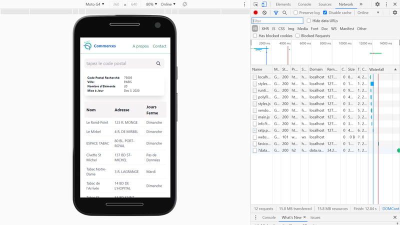
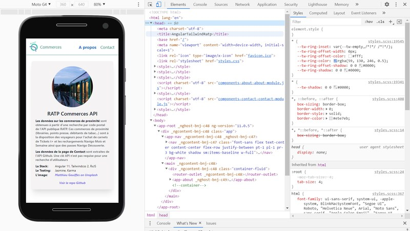
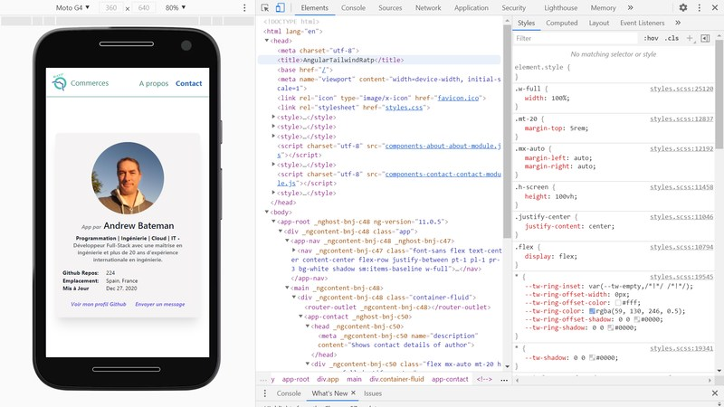
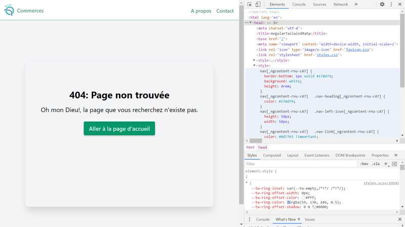

# :zap: Angular Tailwind RATP

* Angular 11 app using [Webpack v5](https://webpack.js.org/) & [Tailwindcss](https://developers.google.com/chart/) components to display information from the [Paris Public Transport RATP API](https://data.ratp.fr/explore/?sort=modified&refine.publisher=RATP)


*** Note: to open web links in a new window use: _ctrl+click on link_**

## :page_facing_up: Table of contents

* [:zap: Angular Tailwind RATP](#zap-angular-tailwind-ratp)
  * [:page_facing_up: Table of contents](#page_facing_up-table-of-contents)
  * [:books: General info](#books-general-info)
  * [:camera: Screenshots](#camera-screenshots)
  * [:signal_strength: Technologies](#signal_strength-technologies)
  * [:floppy_disk: Setup](#floppy_disk-setup)
  * [:wrench: Testing](#wrench-testing)
  * [:computer: Code Examples](#computer-code-examples)
  * [:cool: Features](#cool-features)
  * [:clipboard: Status & To-Do List](#clipboard-status--to-do-list)
  * [:clap: Inspiration](#clap-inspiration)
  * [:envelope: Contact](#envelope-contact)

## :books: General info

* [Tailwind Responsive Table](https://tailwindcomponents.com/component/responsive-table-1) used to show RATP data
* About and Contact pages give more information on app using Tailwind css cards
* Website is in French
* Webpack explained in [Webpack documentation Concepts](https://webpack.js.org/concepts/)
* To build for production Tailwind’s purge option is used to tree-shake unused styles and optimize final build size.
* `angular.json` file modified to use custom builder and `webpack.config.js` file
* **important** npm postcss-loader [must be v4.2.0 and not latest version - ref. Stackoverflow](https://stackoverflow.com/questions/66082397/typeerror-this-getoptions-is-not-a-function) or there will be lots of errors and no dev server
* [rxjs take(1) operater](https://advancedweb.hu/rxjs-the-differences-between-first-take-1-and-single/) used to take first element from the Ratp & Github observable streams then close them, so unsubscribing is not necessary.

## :camera: Screenshots






## :signal_strength: Technologies

* [Angular framework v11](https://angular.io/)
* [@angular/forms](https://angular.io/api/forms) used with [PatternValidator](https://angular.io/api/forms/PatternValidator)
* [Reactive Extensions Library for Javascript rxjs v6](https://rxjs.dev/)
* [Tailwindcss v2](https://tailwindcss.com/) CSS framework

## :floppy_disk: Setup

* Run `npm i` to install dependencies.
* Run `ng serve` for a dev server. Navigate to `http://localhost:4200/`. The app will automatically reload if you change any of the source files.
* Run `ng build` to build the project without css purging. The build artifacts will be stored in the `dist/` directory.
* Run `ng build --configuration production` for a production build with css purging.

## :wrench: Testing

* Run `ng test` to run Jasmine unit tests via [Karma](https://karma-runner.github.io)
* Run `ng e2e` to execute the end-to-end tests via [Protractor](http://www.protractortest.org/).

## :computer: Code Examples

* extract from `home.ts` - div that is only shown if API dataset is empty

```typescript
  <!--Show if no data from API - some postcodes have no RATP commerce-->
  <div class="max-w-xs" *ngIf="!dataToShow && !initialState">
    <div class="info-card bg-white shadow-xl rounded-lg">
      <div class="p-1">
        <p>Aucune RATP donnée à afficher - essayez un autre code postal</p>
      </div>
    </div>
  </div>
```

## :cool: Features

* The RATP & Github APIs do not require an API key
* Postcode search form with error messages checks that only a 5-number postcode is entered
* Tailwind purge results in a very small styles build bundle

## :clipboard: Status & To-Do List

* Status: Working. All files pass linting. App passes unit tests. e2e testing not set up so doesn't pass. Build file is a compact xxxkb thanks to Tailwind’s purge option (manually enabled in `tailwind.config.js`) that tree-shakes unused styles and optimizes the final build size.
* To-Do: optimize, pwa, add spinner, test, e2e test, translations, build with purgecss, deploy with Github pages

## :clap: Inspiration

* [Angular Architects: article: Extending the Angular CLI’s build process without ejecting](https://www.angulararchitects.io/aktuelles/extending-the-angular-clis-build-process/)
* [List of French postal codes](http://www.bioreference.net/encyclopedia/wikipedia/l/li/list_of_french_postal_codes.html)
* [RATP API doc: Commerces de proximité agréés RATP](https://dataratp2.opendatasoft.com/explore/dataset/liste-des-commerces-de-proximite-agrees-ratp/api/?sort=code_postal)
* [StackOverflow: How to solve semi-colon expected css(css-semicolonexpected)](https://stackoverflow.com/questions/61443484/how-to-solve-semi-colon-expected-csscss-semicolonexpected)
* [dev.to: Setup TailwindCSS in Angular the easy way](https://dev.to/angular/setup-tailwindcss-in-angular-the-easy-way-1i5l)

## :envelope: Contact

* Repo created by [ABateman](https://www.andrewbateman.org) - you are welcome to [send me a message](https://andrewbateman.org/contact)
