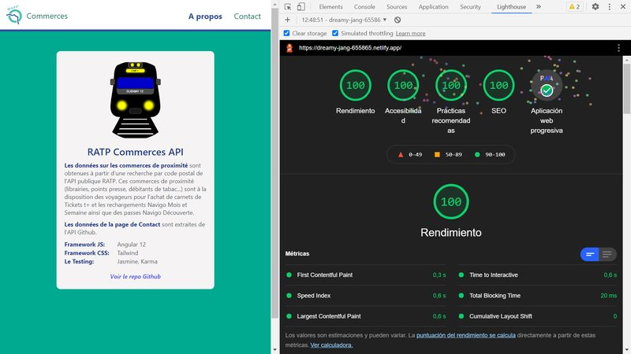
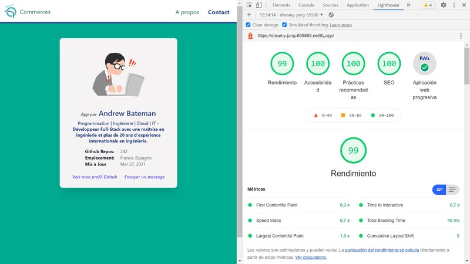

# :zap: Angular Tailwind RATP

* Angular app using [TailwindCSS](https://tailwindcss.com/) components to display information from the [Paris Public Transport RATP API](https://data.ratp.fr/explore/?sort=modified&refine.publisher=RATP) & the [Seine Ouest API](https://data.seineouest.fr/pages/accueil/) disabled parking data
* **Note:** to open web links in a new window use: _ctrl+click on link_


## :page_facing_up: Table of contents

* [:zap: Angular Tailwind RATP](#zap-angular-tailwind-ratp)
  * [:page_facing_up: Table of contents](#page_facing_up-table-of-contents)
  * [:books: General info](#books-general-info)
  * [:camera: Screenshots](#camera-screenshots)
  * [:signal_strength: Technologies](#signal_strength-technologies)
  * [:floppy_disk: Setup](#floppy_disk-setup)
  * [:wrench: Testing](#wrench-testing)
  * [:computer: Code Examples](#computer-code-examples)
  * [:cool: Features](#cool-features)
  * [:clipboard: Status & To-Do List](#clipboard-status--to-do-list)
  * [:clap: Inspiration](#clap-inspiration)
  * [:file_folder: License](#file_folder-license)
  * [:envelope: Contact](#envelope-contact)

## :books: General info

* Home page: User post code search will show a list of retail outlets open to the public within the vicinity of the local RATP station. Note, only post codes with RATP stations will show a list (e.g. 75005 Paris has RATP, but 31000 Toulouse has no RATP), otherwise an error message is shown to try a different post code.
* [Tailwind Responsive Table](https://tailwindcomponents.com/component/responsive-table-1) used to show RATP data
* RATP page: shows status of metro, bus.. using Tailwind micro-cards
* Parking page: shows location of disabled parking as a cluster of icons+popups on a Leaflet map
* About and Contact pages give more information on app using Tailwind css cards
* Website is in French
* To build for production Tailwind’s purge option is used to tree-shake unused styles and optimize final build size.
* [rxjs take(1) operater](https://advancedweb.hu/rxjs-the-differences-between-first-take-1-and-single/) used to take first element from the Ratp & Github observables then close them, so unsubscribing is not necessary.

## :camera: Screenshots






## :signal_strength: Technologies

* [Angular framework v13](https://angular.io/)
* [@angular/forms v13](https://angular.io/api/forms) used with [PatternValidator](https://angular.io/api/forms/PatternValidator)
* [Reactive Extensions Library for Javascript rxjs v7](https://rxjs.dev/)
* [Tailwindcss v3](https://tailwindcss.com/) CSS framework
* [Angular PWA v13](https://angular.io/guide/service-worker-getting-started)
* [Leaflet v1](https://leafletjs.com/) open-source JavaScript library
for mobile-friendly interactive maps
* [Leaflet Marker Cluster](https://github.com/Leaflet/Leaflet.markercluster) Marker Clustering plaugin JS library for interactive maps

## :floppy_disk: Setup

* Run `npm i` to install dependencies.
* Run `ng serve` for a dev server. Navigate to `http://localhost:4200/`. The app will automatically reload if you change any of the source files.
* Run `npm run build` for a production build with css purging. Add defer to index.html css link
* Run `http-server -p 8080 -c-1 dist/angular-tailwind-ratp` to view build on an apple/android phone or simulator (pick 2nd http address supplied)
* The build files will be stored in the `dist/angular-tailwind-ratp` directory.

## :wrench: Testing

* Run `ng test` to run Jasmine unit tests via [Karma](https://karma-runner.github.io). Currrently 9/9 tests pass

## :computer: Code Examples

* `ratp.service.ts` - function to fetch RATP API data based on a postcode string input

```typescript
getRatpData(query: string): Observable<RatpResponse> {
    const userSearchUrl = `${baseUrl}dataset=liste-des-commerces-de-proximite-agrees-ratp&q=${query}&rows=1052&sort=-code_postal&facet=tco_libelle&facet=code_postal`;
    this.ratpResponseData = this.http.get<RatpResponse>(userSearchUrl).pipe(
      take(1),
      catchError((err) => {
        return throwError(
          'There was a problem fetching data from the RATP API, error: ',
          err
        );
      })
    );
    return this.ratpResponseData;
  }
```

## :cool: Features

* The RATP & Github APIs do not require an API key
* Lazy-loading of all pages except 'Home'
* Http headers added due to Content Security Policy for prefetch-src, X Content Type Options, X Frame Options, Content Security Policy
* Postcode search form with validation and error messages checks that only a 5-number postcode is entered
* Tailwind build for production css purge results in a very small styles bundle (8.16kB latest)
* Progressive Web App (PWA)
* Excellent Google Chrome Lighthouse scores for pages: home: 100%, about: 100%, contact 98%
* Netlify deployment set up so commiting a build folder to Github will update the deployment automatically

## :clipboard: Status & To-Do List

* Status: Working, deployed to Netlify. Unable to convert to SSR. All files pass linting. App passes unit tests.
* To-Do: About - Redo SSR. Add parking module, ratp menu 2&3, top menu over map, side menu, Add tests, language translations

## :clap: Inspiration

* [Angular Architects: article: Extending the Angular CLI’s build process without ejecting](https://www.angulararchitects.io/aktuelles/extending-the-angular-clis-build-process/)
* [List of French postal codes](http://www.bioreference.net/encyclopedia/wikipedia/l/li/list_of_french_postal_codes.html)
* [RATP API doc: Commerces de proximité agréés RATP](https://dataratp2.opendatasoft.com/explore/dataset/liste-des-commerces-de-proximite-agrees-ratp/api/?sort=code_postal)
* [StackOverflow: How to solve semi-colon expected css(css-semicolonexpected)](https://stackoverflow.com/questions/61443484/how-to-solve-semi-colon-expected-csscss-semicolonexpected)
* [dev.to: Setup TailwindCSS in Angular the easy way](https://dev.to/angular/setup-tailwindcss-in-angular-the-easy-way-1i5l)
* [CSP: prefetch-src](https://developer.mozilla.org/en-US/docs/Web/HTTP/Headers/Content-Security-Policy/prefetch-src)
* [How does Content Security Policy (CSP) work?](https://stackoverflow.com/questions/30280370/how-does-content-security-policy-csp-work)
* [Mozilla, Link prefetching FAQ](https://developer.mozilla.org/en-US/docs/Web/HTTP/Link_prefetching_FAQ)
* [Mozilla, X-XSS-Protection](https://developer.mozilla.org/en-US/docs/Web/HTTP/Headers/X-XSS-Protection)
* [Website scanner for JavaScript vulnerabilities and security headers](https://snyk.io/test/website-scanner)
* [Stackoverflow: combine-ngstyle-with-condition-if-else](https://stackoverflow.com/questions/37051496/combine-ngstyle-with-condition-if-else)
* [Angular Material Dialog: A Complete Example](https://blog.angular-university.io/angular-material-dialog/)

## :file_folder: License

* This project is licensed under the terms of the MIT license.

## :envelope: Contact

* Repo created by [ABateman](https://github.com/AndrewJBateman), email: gomezbateman@yahoo.com
